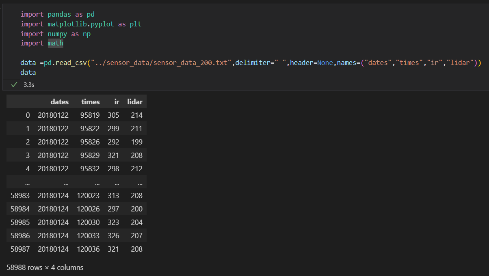
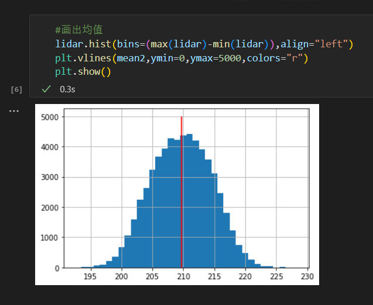
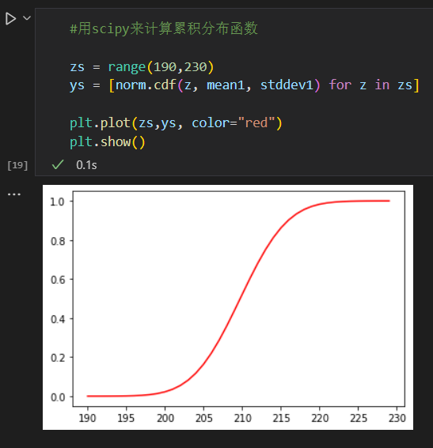
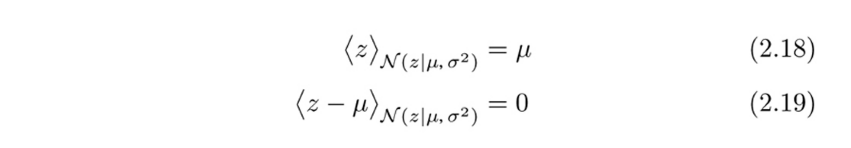

# 第二章 概率统计基础
本章主要通过分析从机器人传感器上取得的数据，来过一边概率论和数理统计的基础知识

## 2.1 收集数据和jupyter notebook上的准备
### 收集传感器数据

* 为了取得本章所用数据所进行的实验 　
* 方法
    * 把机器人放在距离墙壁一个固定距离的位置上
    * 每隔三秒记录一次以下数据，持续两到三天
        * 红外线传感器
        * LiDAR正面方向的数据
        

采取的数据全部放于代码库中sensor_data文件夹下，sensor_data_*.txt ， *的部分是机器人与墙壁的距离(单位mm)

## 得到的数据
保存数据的格式为
日期  时间 红外线传感器数值 LiDAR数值
数据之间用空格来分隔 如下图

可以在python中用pandas来这样读取数据

读取完后比如想查看LiDAR的前5个数据的话

## 频数分布和概率分布
让我们分析一下这组数据中LiDAR的数据的规律
### 2.2.1 画出直方图

bins参数来决定横轴的区间
因为LiDAR数值只有整数 所以设置align来进行左侧对齐，避免直方图中心在***.5的位置上
比较难说明 可以自己把"left"改成"mid"试试看

### 2.2.2  频数 噪音  偏差

刚刚画出的直方图中，横轴是传感器数值，纵轴是这个数值出现的**频数**(也就是次数)

图2.3 

从图中可知：

数据范围是194[mm]-226[mm]
210[mm]的频数很高
离高频数越远的地方频数越低

另外因为机器人是笔者随手放置的，并不是保证一定距离墙壁200[mm]，加上LiDAR自身的基准点不同，所以不用太在意为什么这里频数最高的是200[mm]而不是200[mm]

我们应该注意的是明明机器人没有移动，但是传感器的数据确是波动的。产生波动的原因可能是外部的光源，也可能是内部的电压 电流变化。

这样的数值波动被叫做**噪音**，数值和我们想测量的 [真正的] 数值的差就是**误差**。因为噪音而产生的误差被叫做**偶然误差(随机误差)**

想要从根本上去除噪音是非常麻烦的，因为一般情况下都是会有好几个原因相互作用下产生出的噪音。就算你调查出原因了，也不能保证一定能成功解决。

就算噪音全部去除了，也不能保证传感器输出的就是 [真正的] 数值。
比如LiDAR安装的位置稍微移动了，亦或是机器人自身有倾斜，都会造成数值的不正确
这种情况的数值变化被叫做**偏差**，由于偏差而产生的误差被叫做**系统误差**

### 2.2.3 噪音数值化
寻找噪音的原因并去除是一件很困难的事情。所以在这里我们先不去管产生噪音的原因是什么，先来看看噪音有没有什么规律。[理解不了的东西就放着不管] 这种态度如果是在学习的时候可能是坏习惯，但是在概率 统计学里，这是一个好习惯。

这里我们先来计算一下传感器数据的**平均值**，之后再算算**方差**以及**标准偏差**

对于LiDAR这组数据，我们用下面的这个式子来表达

那么计算平均值的公式就应该是

然后我们在Python上算一下,可以直接计算 也可以用pandas的mean()函数
当然 两者的结果是一致的

接着在刚才的直方图上把均值画出来

接下来计算方差$σ^2$，方差有两种 一种是样本方差，定义是各值和均值的差的平方的平均值

一组数据的变化越大，方差也就越大

另一个则是把上式2.3中的N改为N-1的无偏方差

两种方差在数据量小的的时候差别会很大，但是当N=1000这种量级的时候，几乎就没什么差别了
在Python里面把这两种方差都计算一下

pandas的var()函数默认计算的式无偏方差，而numpy的var则是默认计算样本方差

接下来，计算**标准偏差**，标准偏差是方差的正平方根

标准偏差能比方差更简单地说明一组数据的离散程度。
比如我们这组数据，就可以说成 *平均值是209.7[mm],标准偏差为4.8[mm]*
写成式子的话就是

### 2.2.4 (简单的)概率分布

现在我们来考虑一个问题，我们已经有了0~N-1的LiDAR的数据，能不能以此来预测第N,N+1...的数据呢？如果在实验条件不变的情况下，看着图2.3的直方图，我们可以感觉到频数大的那些数值很 [容易] 出现。而把这个 [容易] 的程度给计算成数值，就是**概率**了。

要在这里完全说明概率的定义的话有点太麻烦了，我们就先从这组LiDAR数据里面简单地考虑一下概率。简单地考虑即是说，在已有的N个数据里面某个数值z出现了m次，那么我们认为z的概率P(z)=m/N

先来计算各个数值出现的频数

接着追加一行概率，通过频度除以数据个数来计算

来看看概率的总和是不是为1

通过计算出的数据我们可以画出一张概率直方图，横轴是各个数值，纵轴则是数值出现的概率

这样，把各个数值的P(z)给组合，描述整体P的变化的一个函数，叫做**概率质量函数**
并且被描述的这个变化的P，我们叫做**概率分布**，也就是上面那张直方图
注意的是概率质量函数是对离散的变量的定义，如果是连续变量的话，相应的函数是后面会提到的**概率密度函数**

### 2.2.5 通过概率分布来进行模拟仿真
计算出概率分布后，我们就可以通过代码来模拟传感器的数据输出  
本书之后会构筑一个机器人模拟器，其中也会用到接下来的方法来模拟传感器输出
用这一段从0~N-1的数据里面，仿真第N个数据

通过pandas的sample函数，设置权重weights="probs"也就是上面计算的概率分布，抽出n=1个数据，其实直接使用这个sample函数权重设置为之前计算的频度的话，不需要概率也可以达到同样的效果，不过难得已经算到概率 ，所以这里姑且就用概率来作为权重进行抽样。

这个处理，写成式子的话就是

接着我们通过这个函数，模拟采样一万次来构建一组数据
把得到的数据给画成直方图，可以看出和之前真实测量的数据基本上是一个形状

### 2.3 概率模型
虽然上面我们通过图2.3的数据来构建了一个模拟函数，但是这个模拟函数是 [完美] 的仿真函数吗？
比如说，虽然图2.3的数据里面，225这个数值确实为0，但是我们模拟采样的 $P_{ZLiDAR}(225)=0$ 这样的结果也是正确的吗？同样的 $P_{ZLiDAR}(230)=0$ ，$P_{ZLiDAR}(1000)=0$ 这些结果也是正确的吗？

对于这样的疑问，恐怕大多数的人会这样想
$P_{ZLiDAR}(225)=0$ 不对劲
$P_{ZLiDAR}(300)=0$ 也有点奇怪
$P_{ZLiDAR}(1000)=0$ 没问题

为什么会有这样的想法？大概是因为我们通过 [常识] 来想象了一个 [真正的概率分布的样子]。

### 2.3.1 遵从正态分布
看到图2.3这样的形状的时候，相信大多数稍微学过概率 统计的人，会觉得这组传感器数据遵从正态分布。在这里我们先假定这是正确的，以它真的遵从正态分布为前提来讨论后面的内容。

虽然LiDAR只会返回整数数值是离散的，但是为了待会讨论的方便 我们这里也假定它的输出是一个连续值，也就是小数点以下 200.1 209.1234这样的数据也有

正态分布的话，例如传感器数值z大于a并且小于b的概率,用公式来表示的话为

这里面μ是平均值

式子的意思和性质我们之后再说，这里先把之前计算的平均值以及方差带入，画出式子2.7以及2.8的变化曲线

式2.8可以用下面这个函数

接着我们对p积分，看看传感器数值限定只有整数的时候的概率分布。
对传感器数值整数x，做[x-0.5,x+0.5)区间的积分
不过因为式2.8不是那么容易积分，所以这里我们用梯形公式来近似积分

和之前计算的概率分布图做比较，正态分布的中央稍微高点 两边稍微矮点 不过大体上是一个形状

正态分布是根据平均值以及方差来决定，可以用以下的式子来简易表示

像这样为了描述某种概率分布的情况，用数式以及参数来表述的过程称为**模型化(建模)**，而其中的数学式子又被叫做**概率模型**。

### 2.3.2 概率密度函数
上一小节中用来画图的式2.8，是正态分布的**概率密度函数(probability density function, pdf)**。
因为对概率密度函数的值进行积分的话，就会得到概率，所以把这个函数的值称为**密度**
假若一个值恰好是200，亦或是恰好是20.0000001，因为连续数字是无限可分的 所以恰好等于其中一个数字的概率约为0
因此在计算概率的时候要像式2.7那样给出一个范围。

这和计算物体的质量是一个道理。假设我们从物体中拿出一点(空间坐标中的一点)，那么点的质量为0。但如果取出的是物体的一块的话，质量就肯定不为0。用密度来解释的话，假设某个物体各点x的密度为p(x),那么物体的某一部分A的质量应该是

在Python里计算正态分布的概率密度函数的时候，可以用SciPy,其中的stats模块中有正态分布密度函数
我们利用这个函数重新计算一次

变量z是实数的时候，如果把概率密度分布p用下面的式子积分的话，就会得到**累积分布函数関数(cumulative distribution function， cdf)**

同样的，stats模块里面已经有了正态分布的累积分布函数，我们直接使用它来画出函数曲线。从图中可以看出，随着x增大 数值渐渐接近于1

刚才我们用梯形公式来近似积分式2.7 ，但如果有累积分布函数的话 计算可以写成这样

这次来用式2.12重新计算一遍概率分布

多数场合会用P来表示概率质量函数，p来表示概率密度函数。但双方都是表达概率分布的函数，所以本书统称其为 [概率分布] ，同时用 x~p,x~p(x)这样的式子来表达从某个概率分布的数据中中随机抽取一个数值

### 2.33 期望值
一个变量如果遵从某个概率分布，那便可以计算他的期望值
期望是，当概率分布为P时，从中无限取值 z~P(z)，z的平均值
z是离散的时候 式子为

连续的时候 式子为

虽然这两个定义式里 z是整数域或者实数域所有的数值，假若z有限定取值范围  因为范围外的数据都会P(z)=p(z)=0，所以定义式仍然是符合情况的

举例来说的话，丢骰子的期望值应该为

一方面，按照定义 我们也可以尽量多丢骰子，通过计算平均值来求得期望的近似值

本书会用$<z>_{p(z)}$, $<z>_{P(z)}$ 来表达z的期望值

我们也可以更一般化，例如从z~p(z)计算的函数f(z)，那么这个函数的期望值应为

同时函数的线性和的期望值，应该等于 函数的期望值的线性和。 这点可以通过计算来验证

也就是说，期望值应该是一个线性函数

假如p(z)是一个已知的分布模型，那么他的期望也是已知的。比如正态分布的场合，期望值就是分布的中心位置。

再来根据方差的定义，有

